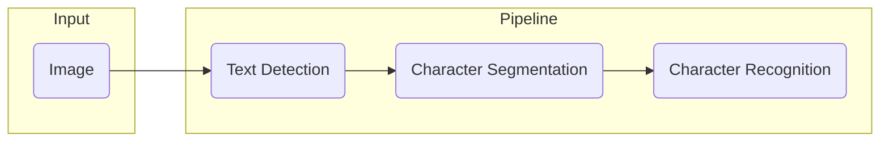

# Application Example

# Photo OCR (Optical Character Recognition)

## Pipeline
- Text Detection (From an image)
- Character Segmentation
- Character Classification

## Sliding Windows

### Text Detection

### 1D Sliding Window for character segmentation

## Getting Lots of Data: Artificial Data Synthesis

- Manually create data or manually labelling a lot of training examples
- Introducing distortions in the existing data and getting more examples out of the current examples

1. Make sure you have a low bias classifier before expending the effort. (Plot learning curves). E.g. keep increasing the number of features/number of hidden units in neural network until you have a low bias classifier.
2. Important Question: “How much work would it be to get 10x as much data as we  currently have?”
	- Artificial Data Synthesis
	- Collect / Label it manually
	- "Crowd Source" (eg. Amazon Mechanical Turk)

## Ceiling Analysis (What part on the pipeline to work on next)
Consider the previous pipeline

Calculating the performance by making components perfect manually, suppose we see

|Component|Accuracy|
|--|--|
|Overall System|72%|
|Text Detection|89%|
|Character Segmentation|90%|
|Character Recognition|100%|

- By having a perfect Text Detection, the accuracy went up by 17%
- But after Text Detection, when Character Segmentation was perfected, the accuracy went up only by 1%
- Again, perfect Character Recognition gave a boost of 10% 

This means, that having a perfect character segmentation can only increase the accuracy by 1%. 
So, putting more work on Text Detection or Character Recognition is better!

